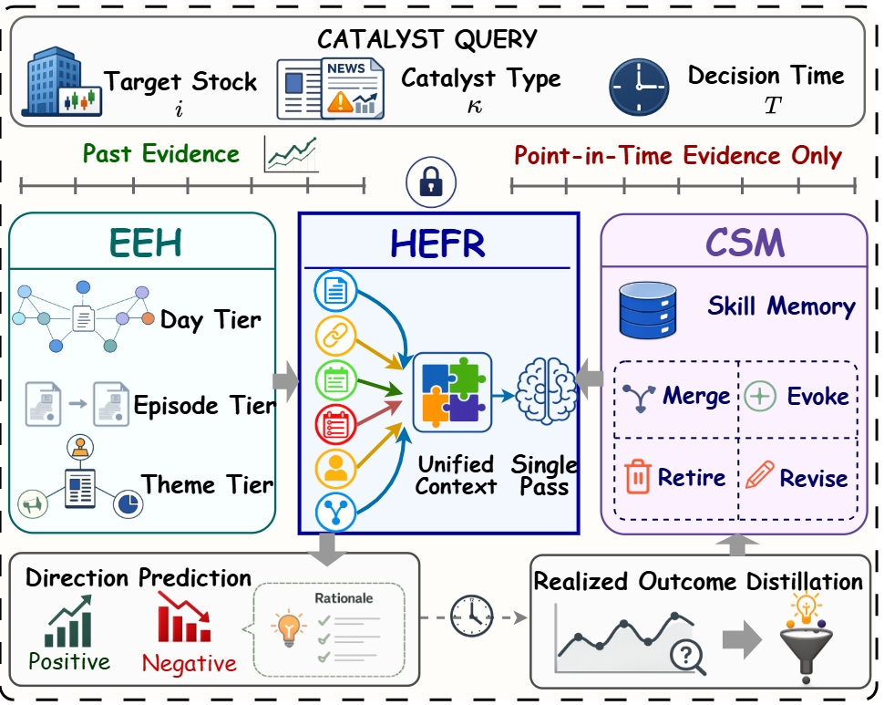
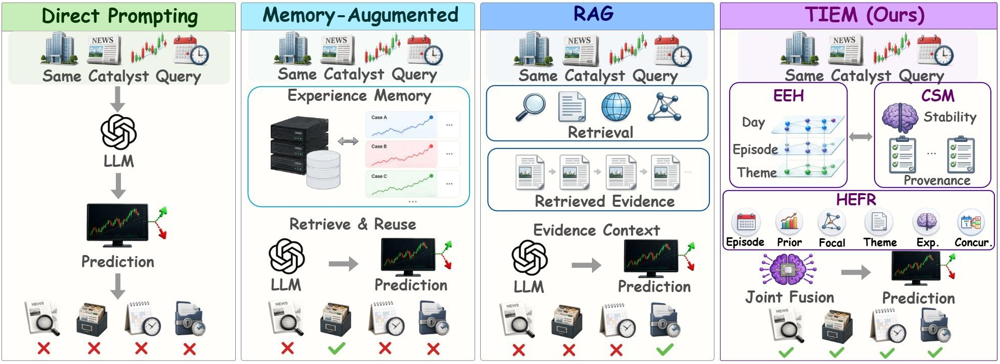
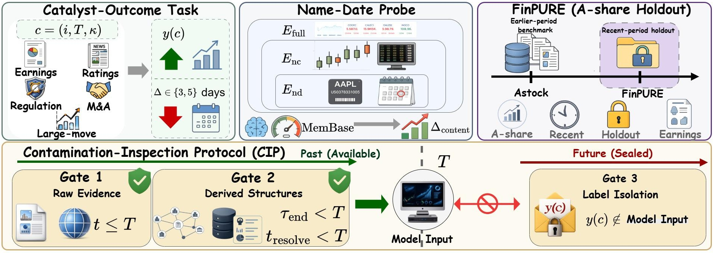
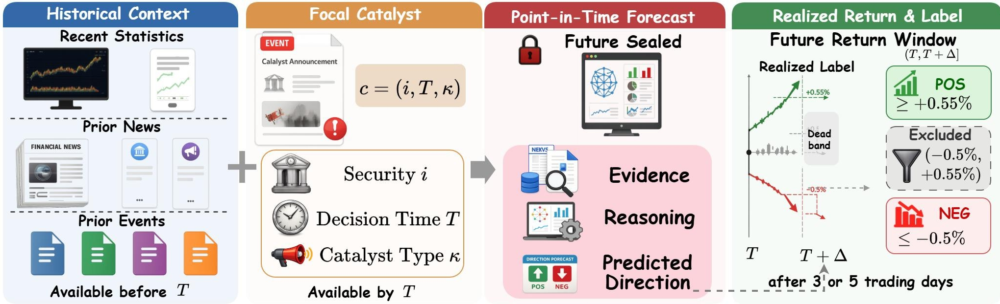

# TIEM

<div align="center">

[]()
[](https://qwenqking.github.io/Fin_TIEM/)
[](https://huggingface.co/datasets/QwenQKing/TIEM-dataset)
[](https://huggingface.co/datasets/QwenQKing/TIEM-databases)


### **TIEM**: Temporal Integration of Hypergraph Evidence and Skill Memory for Event-Driven Financial Forecasting

[Overview](#overview) · [Quick Start](#quick-start) · [Evaluation](#evaluation) · [Datasets](#datasets)

</div>

## Overview

TIEM is a point-in-time-audited framework for event-driven financial forecasting. It combines timestamp-filtered **Event-Evidence Hypergraph (EEH)** retrieval, provenance-tagged **Causal Skill Memory (CSM)**, and **Heterogeneous Evidence-Experience Fusion Reasoning (HEFR)** to predict catalyst outcomes without using information unavailable at the decision time.

<div align="center">
  
</div>

**Framework.** A catalyst query is anchored by its target stock, catalyst type, and decision time. EEH retrieves only past evidence, HEFR builds a unified reasoning context, and CSM supplies reusable causal skills learned from already realized outcomes.

<div align="center">
  
</div>

**Motivation.** Direct prompting can rely on unsupported parametric recall, memory augmentation may introduce hindsight, and conventional RAG can retrieve temporally invalid documents. TIEM jointly reasons over structured evidence and experience to produce an auditable direction forecast.

<div align="center">
  
</div>

**Benchmark and protocol.** Evaluation covers five event-driven forecasting benchmarks—Astock, FinPURE, CMIN-US, EDT, and CSMD—and uses a Name–Date Probe plus the three-gate Contamination Inspection Protocol (CIP) to audit shortcut and contamination risks.

<div align="center">
  
</div>

**Forecasting task.** Given a catalyst and only the evidence available by decision time `T`, the system predicts the direction of the realized return over the benchmark-specific forecast horizon.

## Highlights

- **Point-in-time auditing:** filters evidence and learned skills by timestamp to reduce hindsight leakage.
- **Event-Evidence Hypergraph:** organizes focal events and their temporal, entity, and semantic relations for structured retrieval.
- **Causal Skill Memory:** stores reusable, provenance-aware forecasting experience after outcomes are revealed.
- **Evidence-experience fusion:** validates retrieved skills against current evidence before producing a forecast.
- **Contamination-aware evaluation:** includes FinPURE, the Name–Date Probe, and the three-gate CIP protocol.

## Quick Start

### 1. Install

Python 3.10 or later is recommended.

```bash
pip install -r requirements.txt
```

### 2. Configure the models

Create a `.env` file in the repository root or export the variables in your shell:

```dotenv
OPENAI_API_KEY=your_api_key
OPENAI_BASE_URL=https://api.openai.com/v1
LLM_MODEL=gpt-4o-mini
EMBED_MODEL=text-embedding-3-small
```

`OPENAI_API_KEY` is required. The other variables use the defaults shown above and can be replaced with compatible endpoints and models.

### 3. Build the knowledge bases

The provided script builds a separate Event-Evidence Hypergraph for each benchmark:

```bash
bash scripts/build_databases.sh
```

### 4. Build causal skill memory

The default setup learns the shared experience library from the Astock construction split:

```bash
bash scripts/build_expr.sh
```

## Evaluation

Run inference on all five evaluation sets:

```bash
bash scripts/eval.sh
```

You may pass a different split directory as the first argument, for example:

```bash
bash scripts/eval.sh eval
```

Score a completed run with:

```bash
bash scripts/get_score.sh
```

Predictions, per-case traces, token usage, and summary metrics are written under `results/`. Database artifacts are generated under `databases/`.

## Datasets

| Dataset | Market / setting | Repository path |
| --- | --- | --- |
| Astock | Chinese A-share, in-distribution | `datasets/eval/Astock.json` |
| FinPURE | Recent-period A-share holdout | `datasets/eval/FinPURE.json` |
| CMIN-US | U.S. equity, cross-market OOD | `datasets/eval/CMIN-US_ood.json` |
| EDT | Event-driven temporal OOD | `datasets/eval/EDT_ood.json` |
| CSMD | Cross-setting temporal OOD | `datasets/eval/CSMD_ood.json` |

The corresponding event corpora used to construct EEH are stored in `datasets/data-db/event/`; the Astock experience-construction split is in `datasets/data-db/expr/`.

## Repository Structure

```text
TIME/
├── datasets/              # Event corpora, experience data, and evaluation sets
├── foresight/             # TIEM retrieval, memory, and reasoning implementation
│   ├── stores/            # Evidence, experience, sample, and cache stores
│   └── textkg/            # Event-Evidence Hypergraph construction
├── scripts/               # Database building, inference, and scoring entry points
├── static/                # Paper figures and presentation assets
├── requirements.txt
└── README.md
```

## Disclaimer

TIEM is an academic research project evaluated offline. Its outputs are not investment advice and should not be used as the sole basis for financial decisions.

## BibTex

If you find this work is helpful for your research, please cite:

```bibtex

```

For further questions, please contact: wenjinliu23@outlook.com.

## Acknowledgement

This repo benefits from  . Thanks for their wonderful works.
